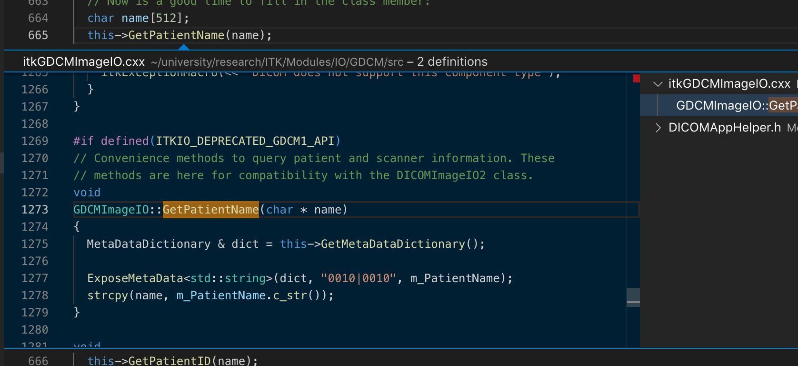

Buffer overflow was discovered during analisys [ImageSeriesReader](https://itk.org/SimpleITKDoxygen/html/classitk_1_1simple_1_1ImageSeriesReader.html).

[ASAN log](./data/buffer-overflow-asan.log)

## Versions:
* Python module SimpleITK 1.2.3 (Linux x64)

The vendor was informed. The weakness was [fixed](https://discourse.itk.org/t/buffer-overflow-in-getting-properties/2363).